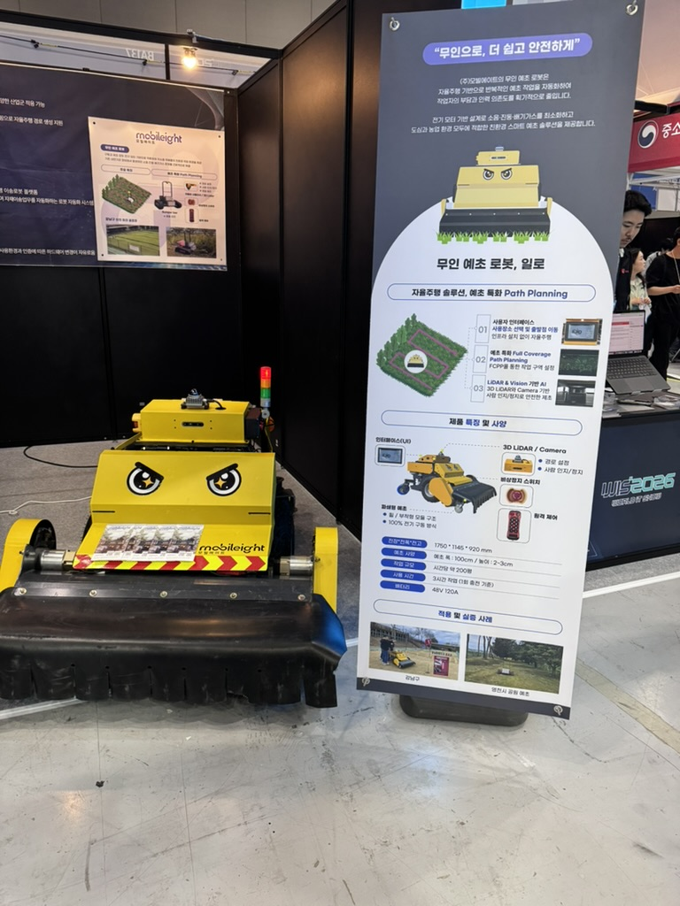
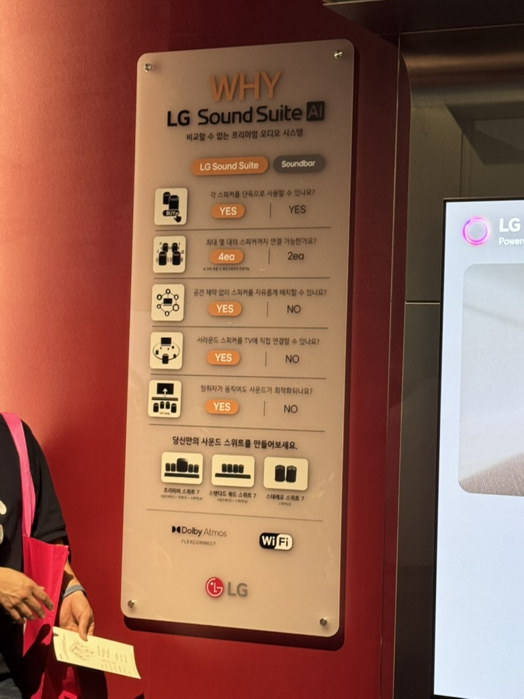
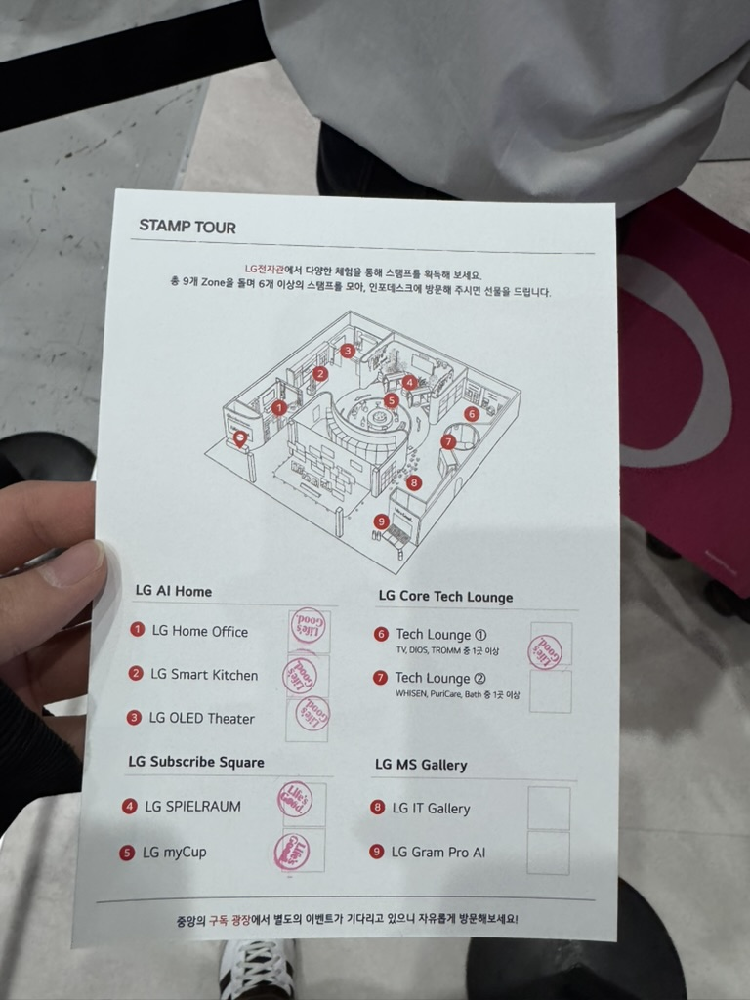
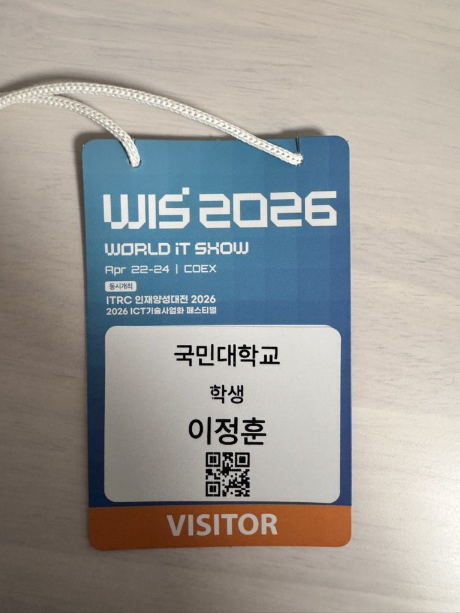

 

# A, B홀
---

4월 24일에 코엑스에서 개최된 World IT Show에 방문했다.  
IT 전시회는 처음 참가해봐서 뭐부터 봐야할지 몰랐다.  
그래서 일단 이곳 저곳 돌아다니면서 어떤 것이 있는지 살펴보기로 했다.

처음엔 A홀과 B홀부터 방문했다. 처음보는 회사들이 많았고 독특한 아이디어의 제품도 있었다.  
전체적으로 둘러봤을 때 ai를 활용한 개발툴이나 문서툴 등이 대체로 많이 있었다. ai를 이용해 일의 효율성과 작업 속도를 배로 상승시키는 것을 목표로 하고 있는 사람들이 많다는 것을 알게 되었다.  
아무래도 개발자들이 많다보니 일을 할 때에 있어 효율적인 자동화를 중시하는 것 같았다.  
이 중에 기억에 남는 것을 나열하자면 무선 예초 로봇, AI기반 실시간 안전감지 솔루션, e스포츠 서비스 자동화 등이 있다.  

확실히 ai를 활용한 기술이 전반적으로 많았다. 현재 기준 경쟁력이 있는 개발자가 되려면 ai를 어떻게 활용하고 사용할 것인가를 아는 것이 중요하다는 생각이 들었다. 그리고 개발의 스킬의 중요성은 떨어지고 도메인과 아이디어 및 설계가 중요하나는 것을 깨달았다. 즉, 시키는 일만 하는 부품으로서의 개발자보다는 직접 PM이 되어 ai라는 부하 직원을 부리며 시장이 원하는 제품을 만들 수 있는 역량을 키워야겠다.

 

# C홀
---

C홀에는 LG, 삼성과 같은 대기업이 배치되어 있었다.  

LG를 방문했다. 여러 세션을 돌아다니면서 스탬프를 모으는 구조로 되어있었다.  

처음에는 냉장고를 봤다. 냉장고에는 사용자가 냉장고를 여는 시간을 학습해 사용자가 열기 전에 미리 온도를 낮춰주는 ai가 탑재되어있다. 냉장고를 열었을 때 냉장고의 온도가 낮아지는 것을 방지하는 기능이다.  
그다음에는 Sound Suite AI라는 오디오 시스템을 체험해봤다. 스피커를 자유롭게 배치할 수 있고 청취자에 움직임에 따라 사운드가 최적화되는 시스템을 탑재하고 있다.  
그외 TV, 세탁기, 공기청정기, 빔프로젝트 등 대부분의 가전제품에 ai를 탑재하고 있었다. 대기업에서도 ai를 어떻게든 활용하고자 함을 느꼈다.

(번외로 상품은 룰렛을 돌려서 텀블러가 당첨됐다ㅎㅎ)

 

# 느낀점
---
생각보다 사람이 많아서 신기했다. 그동안 공부만 했지 이런 전시회를 참가한 적이 거의 없는데 IT에 더 관심을 기울이고 현재 어떤 기술과 제품이 있는지 알아보는 시간을 가져야할 것 같다.  

A, B홀에서 보기만하고 질문은 하지 않았는데 다음에는 꼭 질문해야겠다. 현업의 다양한 사람들의 의견을 들어보고 소통할 수 있는 기회였는데 아깝게 놓친 기분이다. 이번주에 개최하는 AI expo에서는 더 많은 질문을 해볼 예정이다.  

글 읽어주셔서 감사합니다!

